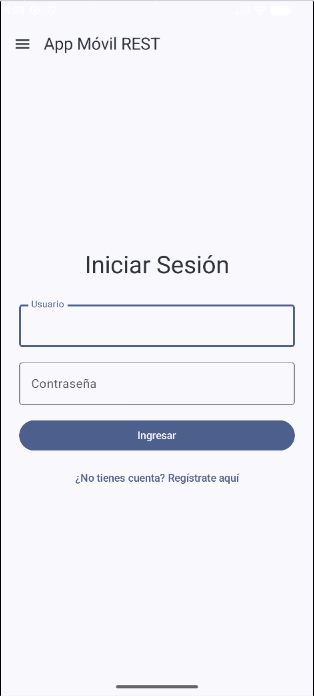
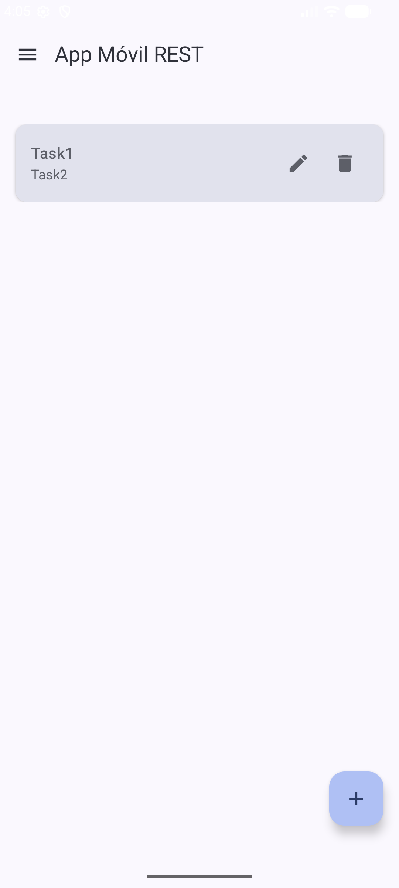
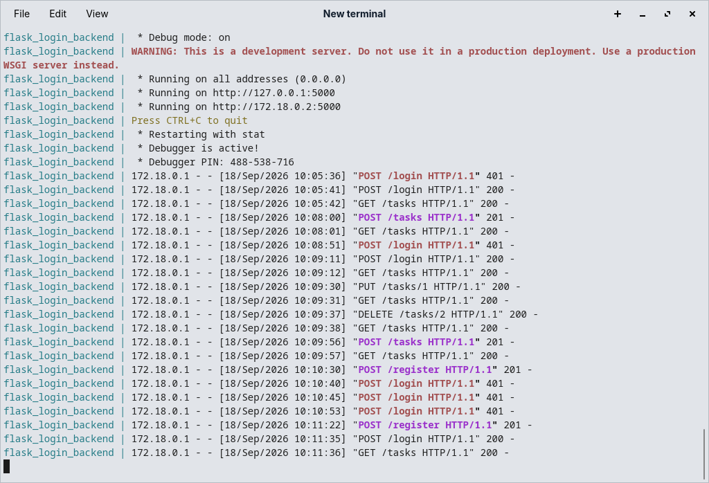

# Práctica 2: Aplicación Móvil Nativa con Backend REST Dockerizado

---

## Portada

* **Nombre Completo:** Agustín Fuentes Luis Angel
* **Boleta:** 2024630134
* **Grupo:** 7CV4
* **Asignatura:** DESARROLLO DE APLICACIONES MOVILES NATIVAS
* **Profesor:** Gabriel Hurtado Aviles
* **Fecha de Entrega:** 18 de Septiembre de 2026

---

## 1. Introducción

En esta práctica se construyó una arquitectura cliente-servidor completa compuesta por una aplicación móvil nativa en **Android (Kotlin)** y una API RESTful containerizada en **Python (Flask)** con persistencia en **SQLite**.

### Justificación del Stack Tecnológico
* **Backend (Python / Flask):** Se seleccionó Flask por su naturaleza ligera y flexible para estructurar microservicios RESTful. Su integración con **Flask-SQLAlchemy** facilita el mapeo objeto-relacional (ORM) sobre una base de datos SQLite embebida, evitando la complejidad de configurar un motor de BD externo.
* **Seguridad y Criptografía (Flask-Bcrypt):** Garantiza que las contraseñas nunca se almacenen en texto plano. Utiliza el algoritmo de hashing unidireccional `bcrypt` junto con la adición de sal aleatoria (*salt*) por cada contraseña.
* **Containerización (Docker & Docker Compose):** Permite empaquetar el servidor web, las dependencias de Python y la configuración del entorno para garantizar que el servicio pueda ejecutarse desde cero en cualquier máquina con `docker compose up --build`.
* **Cliente Móvil (Android / Jetpack Compose):** Implementa una interfaz de usuario reactiva escrita en Kotlin, conectada al backend REST mediante **Retrofit** y procesando peticiones asíncronas con Corrutinas.

---

## 2. Desarrollo

### 2.1 Conceptos Clave
* **Arquitectura RESTful:** Modelo de arquitectura de software para la transferencia de estados representados en formato JSON de manera apátrida (*stateless*).
* **Hashing con Sal (Bcrypt):** Técnica criptográfica que concatena un valor aleatorio único (sal) a la contraseña antes de procesar el hash, previniendo ataques por tablas arcoíris (*rainbow tables*).
* **Manejo de Sesiones y Protección 401:** Mecanismo de control de acceso donde las rutas protegidas del servidor validan la identidad o el token del usuario en cada petición HTTP, rechazando aquellas no autenticadas con el código de estado `401 Unauthorized`.
* **Puente de Red del Emulador (`10.0.2.2`):** Dirección IP virtual asignada por el emulador QEMU/Android Studio que permite redirigir el tráfico del dispositivo virtual hacia el `localhost` (`127.0.0.1`) de la máquina anfitriona.

---

### 2.2 Documentación de Endpoints REST

#### **1. Autenticación de Usuarios**

* **`POST /register`**
  * **Descripción:** Registra un nuevo usuario encriptando su contraseña con Bcrypt.
  * **Petición (JSON):**
    ```json
    { "username": "agustin", "password": "mi_password_secreto" }
    ```
  * **Respuesta Exitosa (`201 Created`):**
    ```json
    { "message": "Usuario creado exitosamente" }
    ```
  * **Respuesta de Error (`400 Bad Request`):**
    ```json
    { "message": "El usuario ya existe" }
    ```

* **`POST /login`**
  * **Descripción:** Autentica a un usuario verificando la contraseña contra el hash guardado.
  * **Petición (JSON):**
    ```json
    { "username": "agustin", "password": "mi_password_secreto" }
    ```
  * **Respuesta Exitosa (`200 OK`):**
    ```json
    { "status": "success", "message": "Login exitoso", "user_id": 1, "username": "agustin" }
    ```
  * **Respuesta de Error (`401 Unauthorized`):**
    ```json
    { "status": "error", "message": "Credenciales inválidas" }
    ```

---

#### **2. CRUD de Tareas (`/tasks`)**

* **`GET /tasks`**
  * **Descripción:** Obtiene la lista completa de tareas guardadas en la base de datos.
  * **Respuesta Exitosa (`200 OK`):**
    ```json
    [
      { "id": 1, "title": "Completar Práctica 2", "description": "Subir repositorio a GitHub" }
    ]
    ```

* **`POST /tasks`**
  * **Descripción:** Crea un nuevo registro de tarea en SQLite.
  * **Petición (JSON):**
    ```json
    { "title": "Estudiar Docker", "description": "Repasar comandos de Compose" }
    ```
  * **Respuesta Exitosa (`201 Created`):**
    ```json
    { "id": 2, "title": "Estudiar Docker", "description": "Repasar comandos de Compose" }
    ```

* **`PUT /tasks/<int:task_id>`**
  * **Descripción:** Modifica los campos de una tarea existente dada su ID.
  * **Petición (JSON):**
    ```json
    { "title": "Estudiar Docker y Flask", "description": "Repasar comandos de Compose y ORM" }
    ```
  * **Respuesta Exitosa (`200 OK`):**
    ```json
    { "id": 2, "title": "Estudiar Docker y Flask", "description": "Repasar comandos de Compose y ORM" }
    ```

* **`DELETE /tasks/<int:task_id>`**
  * **Descripción:** Elimina definitivamente una tarea por su ID.
  * **Respuesta Exitosa (`200 OK`):**
    ```json
    { "message": "Tarea eliminada", "status": "success" }
    ```
  * **Respuesta de Error (`404 Not Found`):**
    ```json
    { "message": "La tarea especificada no existe" }
    ```

---

### 2.3 Explicación del Archivo Dockerfile y docker-compose.yml

#### **`Dockerfile` (`Docker-Flask/ORM/Dockerfile`)**
* `FROM python:3.9-slim`: Utiliza una imagen liviana oficial de Linux con Python 3.9 preinstalado.
* `WORKDIR /app`: Establece el directorio de trabajo dentro del contenedor.
* `COPY requirements.txt .`: Copia el archivo de dependencias al contenedor.
* `RUN pip install --no-cache-dir -r requirements.txt`: Instala `Flask`, `Flask-SQLAlchemy` y `Flask-Bcrypt` dentro de la imagen.
* `COPY . .`: Copia todo el código fuente (`app.py`) al contenedor.
* `EXPOSE 5000`: Expone el puerto 5000 para permitir el tráfico HTTP.
* `CMD ["python", "app.py"]`: Comando que arranca el servidor web cuando se inicia el contenedor.

#### **`docker-compose.yml` (`Docker-Flask/ORM/docker-compose.yml`)**
* `version: '3.8'`: Especifica la versión de la sintaxis de Docker Compose.
* `services.web.build: .`: Le indica a Compose que construya la imagen leyendo el `Dockerfile` de la carpeta actual.
* `ports: - "5000:5000"`: Mapea el puerto 5000 de la máquina anfitriona con el puerto 5000 del contenedor.
* `volumes: - .:/app`: Monta un volumen en tiempo real para que cualquier cambio en `app.py` o la BD `site.db` persista fuera del contenedor.

---

### 2.4 Instrucciones de Instalación y Ejecución

#### Paso 1: Levantar el Backend REST

1. Abrir la terminal y navegar hasta la carpeta del backend:
   ```bash
   cd Docker-Flask/ORM/
2. Ejecutar el contenedor forzando la reconstruccion
    ```bash
    docker-compose up --build
    ```
    El servicio estara en http://localhost:5000

3. Probar los endpoints con curl

    Verificar que el servidor está activo
    ```bash
    curl http://localhost:5000/
    ```
    Registrar un usuario
    ```bash
    curl -X POST http://localhost:5000/register \
        -H "Content-Type: application/json" \
        -d "{\"username\":\"agustin_dev\",\"password\":\"password_seguro\"}"
    ```
    Iniciar sesión
    ```bash
    curl -X POST http://localhost:5000/login \
        -H "Content-Type: application/json" \
        -d "{\"username\":\"agustin_dev\",\"password\":\"password_seguro\"}"
    ```

4. Ejecutar la aplicacion movil
    
    Abrir la carpeta *Android/FlaskLogin* en **Android Studio**

    Selecionar un emulador y presionar *Run*


5. Evidencia de funcionamiento

<details>
  <summary><b>Haz clic aquí para ver las evidencias de capturas de Pantalla</b></summary>

<br>

| Pantalla de Login | Interfaz CRUD de Tareas | Contenedor Docker en Ejecución | Video de funcionamiento
| :---: | :---: | :---: | :---: |
|  |  |  |  | 

</details>


# Flask Login API + Android Client

Este repositorio contiene dos componentes: un backend REST construido con Flask y dockerizado, y una app Android base en Kotlin para consumirlo.

---

## Backend — `Docker-Flask/ORM/`

API REST minimalista para registro e inicio de sesión de usuarios. Usa **Flask-SQLAlchemy** para persistencia con SQLite y **Flask-Bcrypt** para hashear contraseñas. No requiere configurar una base de datos externa; el archivo `site.db` se crea automáticamente al iniciar.

### Endpoints

| Método | Ruta | Descripción |
|---|---|---|
| `GET` | `/` | Verifica que la API está activa |
| `POST` | `/register` | Registra un nuevo usuario |
| `POST` | `/login` | Autentica un usuario existente |

#### `POST /register`

```json
// Request
{ "username": "alice", "password": "secreto123" }

// Response 201
{ "message": "Usuario creado exitosamente" }

// Response 400 (usuario duplicado)
{ "message": "El usuario ya existe" }
```

#### `POST /login`

```json
// Request
{ "username": "alice", "password": "secreto123" }

// Response 200
{ "status": "success", "message": "Login exitoso", "user_id": 1, "username": "alice" }

// Response 401
{ "status": "error", "message": "Credenciales inválidas" }
```

### Levantar con Docker

```bash
cd Docker-Flask/ORM
docker compose up --build
```

El servicio queda disponible en `http://localhost:5000`. Si modificas `app.py` mientras el contenedor está corriendo, Flask recarga automáticamente gracias al volumen montado y al modo debug.

### Probar con curl

```bash
curl http://localhost:5000/

curl -X POST http://localhost:5000/register \
     -H "Content-Type: application/json" \
     -d "{\"username\":\"android_dev\",\"password\":\"mi_password_secreto\"}"

curl -X POST http://localhost:5000/login \
     -H "Content-Type: application/json" \
     -d "{\"username\":\"android_dev\",\"password\":\"mi_password_secreto\"}"
```

### Stack

- Python 3.9 (imagen `python:3.9-slim`)
- Flask · Flask-SQLAlchemy · Flask-Bcrypt
- SQLite (archivo local, no requiere servicio externo)
- Docker Compose

---

## App Android — `Android/FlaskLogin/`

Proyecto base generado con Android Studio usando **Kotlin** y **Jetpack Compose** (Material 3). El `MainActivity.kt` es el punto de partida; la lógica de conexión con la API queda pendiente de implementar.

**Configuración:** `minSdk 24`, `targetSdk 36`.

### Conectar al backend desde el emulador

El emulador AVD no resuelve `localhost` de la máquina host. Usa `http://10.0.2.2:5000` en su lugar. Con un dispositivo físico en la misma red, usa la IP local de tu PC.

Agrega en `AndroidManifest.xml`:

```xml
<uses-permission android:name="android.permission.INTERNET" />
```

Y dentro de `<application>`:

```xml
android:usesCleartextTraffic="true"
```
